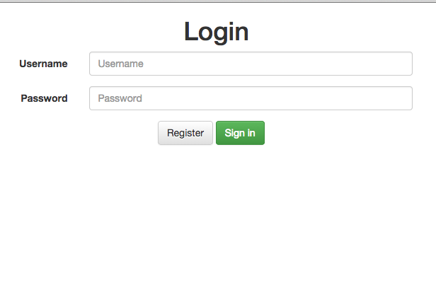
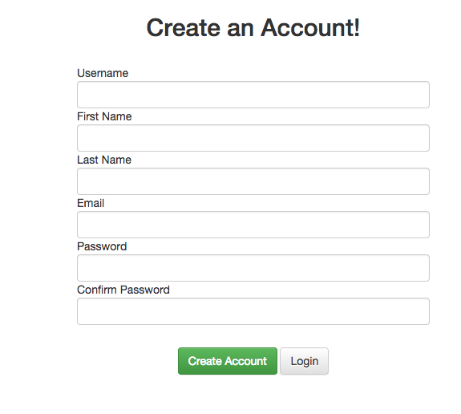

Simple Login System that Connects to MySQL
==============
 
V-1.1  
Added more security and refactored code 
-User cant register with special chars or spaces 
-More info about what the user did wrong (invalid email/passwords didnt match) 
-Put database code into functions and moved to /Model 
-Added password hash
Simple Register System that Registers Users to MySQL
==============

